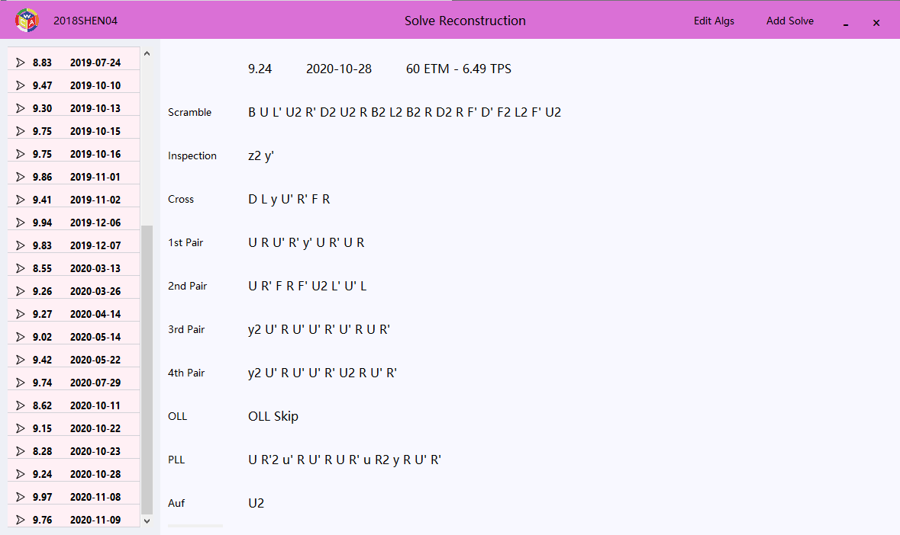
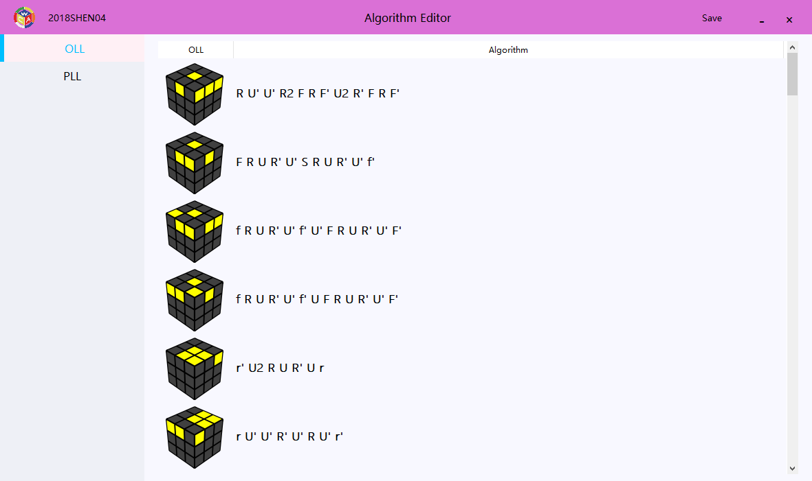
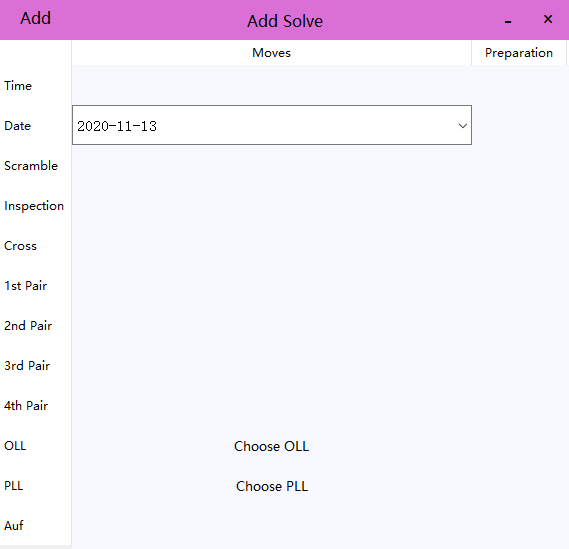

## Requirements

- Python 3.7.6
- SQLite3
- PyQt5

## Get Start

### Initialize Database

```shell
python sqlite_db.py
```

### Start

```shell
python main.py [-n <your username>]
```

Or you can add username to 'default' parameter in `parse.add_argument('-n', '--name', help='Please Enter Username', default=' ') ` in main.py and start with `python main.py`

### Import OLL & PLL Algorithms

- Click "Edit Algs" on top bar;
- After adding algorithms, click "Save" on top bar.

### Add Solve

- Click "Add Solve" on top bar;
- Complete the record according to the instructions on "Add Solve" window;
- Click "Add" on top bar.

## UI







## Reference

- [AlgDb](http://algdb.net/puzzle/333) for all pictures

## To Do

- Edit solve function
- Store database on cloud(Onedrive?)
- Check if the solution is right